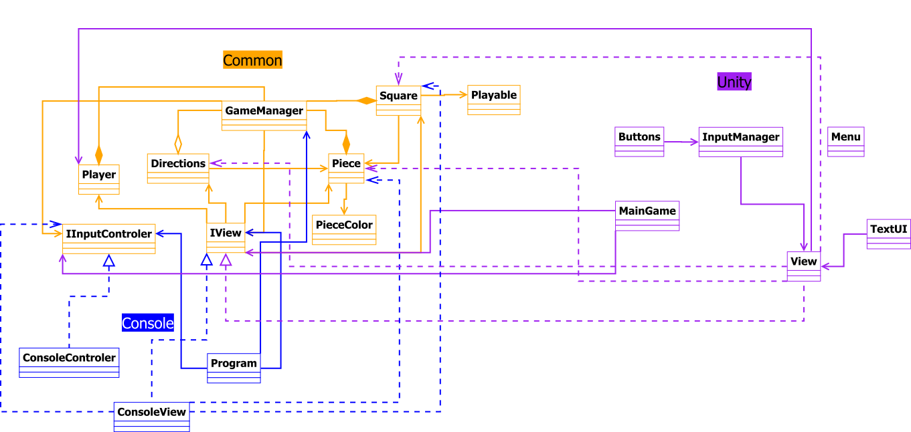

# PROJETO 3 LP2

## Autores

* [Diogo Maia](https://github.com/Diogo-Maia), a21901308
* [Inês Gonçalves](https://github.com/ineesgoncalvees), a21702076

## Repartição de Tarefas

* Diogo Maia
  * Unity UI
  * Preparou o repositório git com o sub-modulo
  * Interface IInputControler
  * Interface IView
  * Finalizou projeto da consola
  * Fez maior parte do código do Unity

* Inês Gonçalves
  * Relatório
  * UML
  * Unity UI
  * ConsoleControler
  * Começou a trabalhar no projeto da consola
  * Colocou o cógido no ramo common

## Repositório

O projeto pode ser encontrado neste [repositório](https://github.com/Diogo-Maia/LP2Projeto3).

## Arquitetura da solução

Este projeto foi feito utilizando designg patern MVC (Model-View-Controler), que 
consiste na ultilização de um modelo que tem toda a lógica do programa,
independete de toda a parte da interface e controlo, sendo estes controlados respetivamente pela 'View' e pelo 'Controler'.
O nosso projeto está organizado dessa forma, havendo um sub-modulo com o código
comum aos dois projetos, que funciona como se fosse uma biblioteca, e depois
cada projeto tem a sua 'View' e o seu 'Controler' específicos.

Para tornar mais fácil o processo de utilização do código comum criamos duas 
interfaces, uma chamada IView, que tem os métodos base que cada classe View deve
implementar, e uma chamada IInputControler, que faz o mesmo mas para a parte do
controlo do programa (maioritariamente inputs e outputs).

Usámos também os desing paterns GameLoop e Facade. O Unity já usa o GameLoop por
si, mas usamos também no código comum, na classe GameManager. Usamos do Facade
tendo classes como o GameManager.
Tivemos em conta também o principio SOLID Single Responsability.

O projeto da Consola tem apenas duas classes e o Program. Ambas implementam a respetiva interface usando os métodos necessários.

No projeto do Unity usamos multitreading, porque ao contrário da consola que fica
à espera de input do utilizador, no Unity isso não era possivel da mesma forma,
então criamos uma tread nova para conseguir pôr o código a correr enquanto aguarda input.

### Diagrama UML

O UML deste projeto é o seguinte:

## Referências

A [API do C#](https://docs.microsoft.com/en-us/dotnet/csharp/).

A maioria do código no ramo comum é o mesmo que o Diogo Maia e o André Pedro
fizeram para o segundo projeto desta cadeira, tendo sido adaptado às necessidades deste projeto.